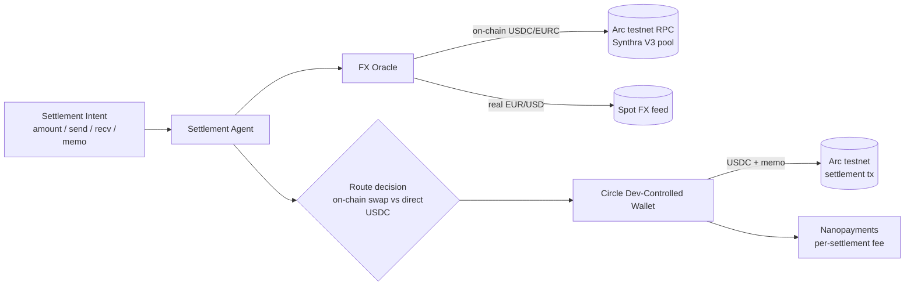

# FX-aware Settlement Agent

**The Stablecoins Commerce Stack Challenge — Track 4: Agentic Economy**
Built on **Arc** (Circle's stablecoin L1) testnet.

An autonomous agent that settles **cross-currency stablecoin payments at the
best available on-chain rate**. It reads the live on-chain USDC↔EURC price on
Arc, compares it to the real-world EUR/USD rate, and routes each payment the
cheaper way — capturing FX dislocations instead of blindly converting at spot —
then settles in USDC via a Circle Developer-Controlled Wallet and attaches a
transaction memo for reconciliation.

> Educational / testnet demo only. Read-only market data; settlement defaults to
> dry-run and moves no funds unless explicitly enabled on testnet.

## Why this matters

Cross-border and agentic commerce constantly convert between currencies. Doing
that at the naive spot rate leaves money on the table whenever a stablecoin
(e.g. EURC) trades off-peg on-chain. An agent that *prices the route* before it
pays turns Arc's stablecoin-FX rails into measurable savings — and does it
autonomously, per payment.

## Architecture



- **`arc_client.py`** — read-only Arc testnet client (raw JSON-RPC; ERC-20 +
  Uniswap-V3-style pool reads). The FX data engine.
- **`fx_oracle.py`** — implied on-chain USD/EUR vs real EUR/USD → basis → route.
- **`agent.py`** — orchestrates intent → quote → route → settle.
- **`circle_wallet.py`** — Circle Developer-Controlled Wallets wrapper
  (server-side signing; dry-run by default).

## Circle products used (on Arc)

- **USDC** — settlement rail (native on Arc).
- **Circle Wallets** (Developer-Controlled) — server-side signing, no raw keys.
- **Nanopayments** — per-settlement service fee (sub-cent) concept.
- **StableFX** *(conceptual)* — multi-currency routing target once access is
  granted; the agent's route logic is built to plug into it.

## Live proof (Arc testnet)

A real, agent-executed USDC settlement (1 USDC, FX-aware route, memo attached),
signed server-side by a Circle Developer-Controlled Wallet:

> tx `0xbeb17f3513914f502012c81fcb4e7252464e6306b8f8a6e5238f9d302691234f`
> https://testnet.arcscan.app/tx/0xbeb17f3513914f502012c81fcb4e7252464e6306b8f8a6e5238f9d302691234f

The on-chain FX leg uses a clearly-labeled **simulated** rate until a live Arc
USDC/EURC pool address is wired (set `SYNTHRA_USDC_EURC_POOL`); the settlement
leg is fully real.

## Setup & run

```bash
pip install -r requirements.txt
cp .env.template .env          # add Circle API key to enable real settlement

python agent.py                # CLI: end-to-end plan (dry-run), live Arc testnet
python web.py                  # Web UI at http://localhost:8000 (frontend+backend)
python circle_setup.py         # one-time: provision entity secret + ARC-TESTNET wallet
python demo_settle.py          # real 1-USDC settlement demo (moves testnet funds)
```

Arc testnet reference: RPC `https://rpc.testnet.arc.network`, chainId `5042002`,
USDC `0x3600…0000`, EURC `0x89B5…D72a`.

## Circle Product Feedback

*Why these products:* USDC + Developer-Controlled Wallets let an agent settle
autonomously without us ever handling private keys, which is exactly the trust
model an agentic payment system needs. Nanopayments fits per-settlement pricing.

*What worked well:* Reading Arc testnet over plain JSON-RPC was frictionless —
`eth_call` against the documented USDC/EURC addresses worked first try, and
USDC-as-gas removes the usual native-token funding step. Deterministic finality
makes settlement receipts simple to reason about.

*What could be improved:* DEX pool addresses (e.g. Synthra USDC/EURC) aren't yet
discoverable from the public docs or the standard Uniswap registry, so wiring an
on-chain price source required hunting through the app UI. A canonical
testnet "deployed pools / token pairs" list in the docs would save builders time.

*Recommendation:* Publish a machine-readable registry of testnet DEX/pool
addresses (and StableFX corridors as they go live) alongside the contract-address
docs, so price-oracle and routing builders can integrate programmatically.

## License

MIT — see [LICENSE](LICENSE).
